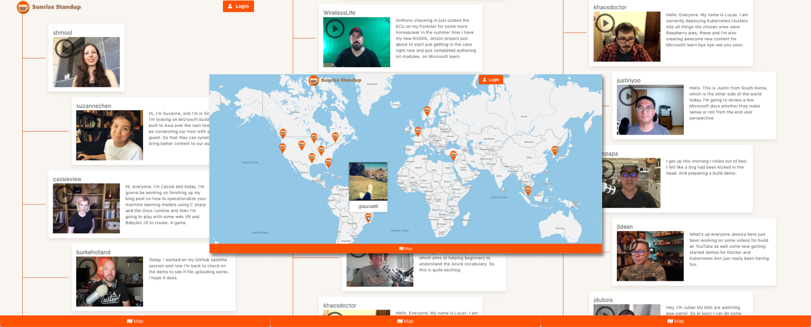

# Sunrise Standup

Sunrise Standup is a status update application built as a demo for Build 2020. It allows users to submit a 15 second status update video clip and displays those clips in order by date in a feed. The user's location is recorded and displayed on an interactive map.



## Setup Azure Resources

Before you can run the application, you'll need to setup Azure Storage (for uploading videos) and Azure Maps for the interactive map. You'll need to setup both of those resources and copy the correct keys into the app settings files.

1. Rename the "api/local.settings.json.rename" to "api/local.settings.json".

1. Rename the ".env.rename" to ".env"

### Setup Azure Storage

1. Create a new Azure Storage account.

1. Create two containers - "raw" and "thumbnails". The "raw" folder holds the videos, and the "thumbnails" folder will hold the video thubnails.

1. From the "Access keys" section, copy the following values into the "local.settings.json" file.

   | Access key setting   | local.settings.json setting |
   | -------------------- | --------------------------- |
   | Storage account name | STORAGE_ACCOUNT             |
   | Key                  | STORAGE_KEY                 |
   | Connection string    | STORAGE_CONNECTION_STRING   |

1. Set the value of "STORAGE_ACCOUNT" in the ".env" file.

### Setup Azure Maps

1. Create a new Azure Map

1. Copy the "Primary key" to the "MAP_KEY" setting of the ".env" file.

## Running the application locally

This project can be run anywhere, but VS Code is required for local debugging.

1. Open the application with VS Code.

### Running the frontend

1. Install frontend dependencies...

   ```bash
   npm install
   ```

1. Run the frontend project in the browser (automatically opens a browser window).

   ```bash
   npm start
   ```

### Running the API

1. From VS Code, press <kbd>F5</kbd>

## Deploying the App to Static Web Apps

1. Create a new Static Web App.

1. Select the Github repo for this project from the Azure Web Apps create screen.

For more information on Static Web Apps, check out the [Static Web Apps documentation](https://aka.ms/swadocs).
